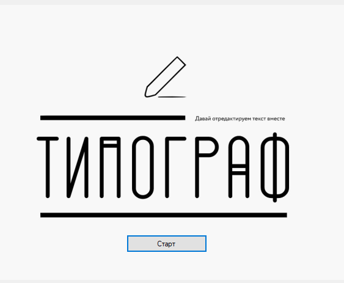
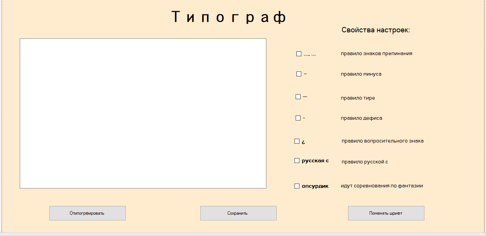

## Типограф

##### Технологии: C#, Windows Forms, Unit test.

Программа предназначена для автоматизации обработки текста. Она оперирует следующими данными:
- текст, который ввел пользователь;

Программа обеспечивает возможность выполнения перечисленных ниже функций:
- возможность вывода исправленного программой текста;
- возможность удаления/добавления текста;
- возможность выбора правил для оттипографирования текста; 

